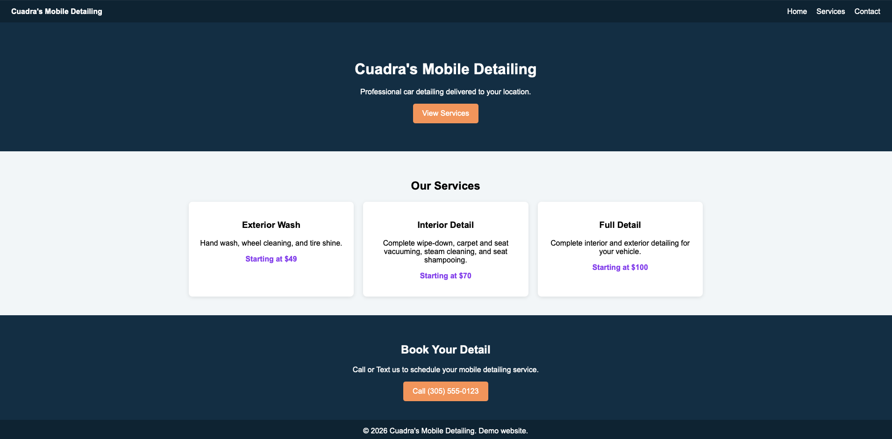

# Cuadra's Mobile Detailing

A responsive mobile-detailing website created as a fictional business demo.

## Live Website

https://mobile-detailing-demo-website.pages.dev/

## Project Preview



## Project Overview

This project demonstrates the design, development, testing, and deployment of a responsive website for a fictional mobile detailing business.

The website allows visitors to:

- Review available detailing services
- View starting prices
- Navigate between page sections
- Contact the business from a mobile device

## Technologies Used

- HTML5 for the website structure
- CSS3 for layout, styling, and responsive design
- JavaScript for automatically updating the footer year
- Git and GitHub for version control
- Cloudflare Pages for deployment

## Features

- Responsive desktop and mobile layout
- Navigation links with smooth scrolling
- Service cards with pricing information
- Click-to-call contact button
- Keyboard-visible focus states for accessibility
- Descriptive page title and metadata
- Automatically updated copyright year
- Consistent card sizing across the service section

## Run Locally

## Run Locally

1. Clone the repository:

   ```bash
   git clone git@github.com:Walter1215/mobile-detailing-demo-website.git
   ```

2. Open the project folder in VS Code.

3. Open `index.html` with the Live Server extension.

## Quality Assurance

The website was manually tested for:

- Desktop and mobile responsiveness
- Navigation and smooth scrolling
- Click-to-call functionality
- Keyboard accessibility
- Consistent service-card sizing
- Page title and metadata
- Production deployment

### QA Documentation

- [QA Case Study](qa/QA_CASE_STUDY.md)
- [Manual Test Cases](qa/TEST_CASES.md)
- [Bug Reports](qa/BUG_REPORTS.md)
- [Test Summary Report](qa/TEST_SUMMARY.md)

